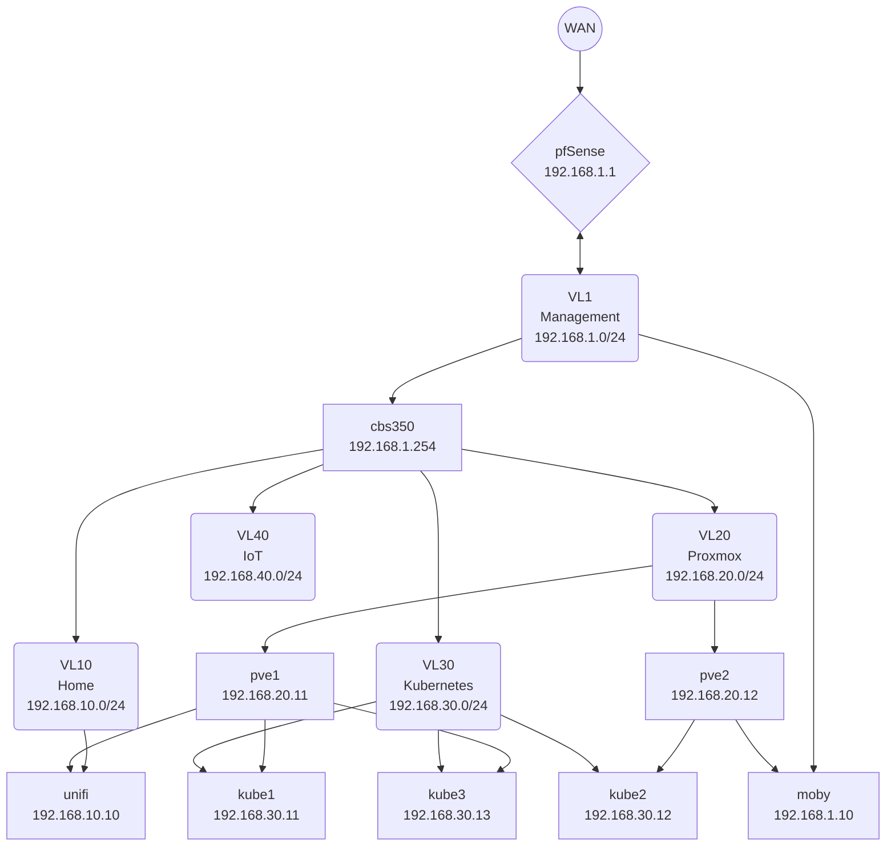

# network

```mermaid
flowchart TD
  A((WAN)) --> PFSENSE{pfSense<br>192.168.1.1}
  PFSENSE <--> VL1(VL1<br>Management<br>192.168.1.0/24)
    VL1 --> CBS350[cbs350<br>192.168.1.254]
    VL1 --> MOBY[moby<br>192.168.1.10]
  CBS350 --> VL10(VL10<br>Home<br>192.168.10.0/24)
    VL10 --> UNIFI[unifi<br>192.168.10.10]
  CBS350 --> VL20(VL20<br>Proxmox<br>192.168.20.0/24)
    VL20 --> PVE1[pve1<br>192.168.20.11]
      PVE1 --> UNIFI
      PVE1 --> KUBE1
      PVE1 --> KUBE3
    VL20 --> PVE2[pve2<br>192.168.20.12]
      PVE2 --> MOBY
      PVE2 --> KUBE2
  CBS350 --> VL30(VL30<br>Kubernetes<br>192.168.30.0/24)
    VL30 --> KUBE1[kube1<br>192.168.30.11]
    VL30 --> KUBE2[kube2<br>192.168.30.12]
    VL30 --> KUBE3[kube3<br>192.168.30.13]
  CBS350 --> IOT(VL40<br>IoT<br>192.168.40.0/24)
```
