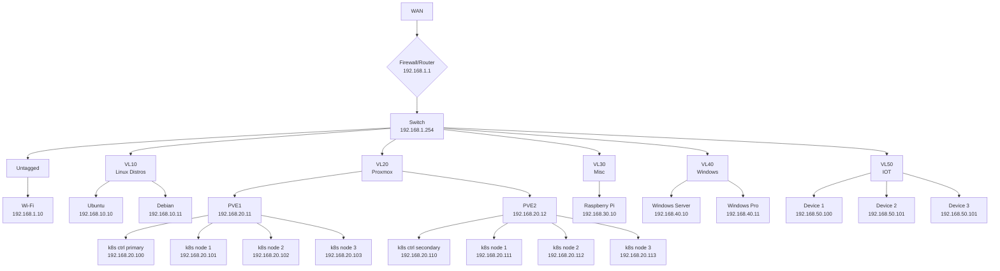

# network

```mermaid
flowchart TD
  A[WAN] --> B{Firewall/Router<br>192.168.1.1}
  B --> C[Switch<br>192.168.1.254]
  C --> CA[Untagged]
    CA --> CAA[Wi-Fi<br>192.168.1.10]
  C --> CB[VL10<br>Linux Distros]
    CB --> CBA[Ubuntu<br>192.168.10.10]
    CB --> CBB[Debian<br>192.168.10.11]
  C --> CE[VL20<br>Proxmox]
    CE --> CEA[PVE1<br>192.168.20.11]
      CEA --> CEAA[k8s ctrl primary<br>192.168.20.100]
      CEA --> CEAB[k8s node 1<br>192.168.20.101]
      CEA --> CEAC[k8s node 2<br>192.168.20.102]
      CEA --> CEAD[k8s node 3<br>192.168.20.103]
    CE --> CFB[PVE2<br>192.168.20.12]
      CFB --> CFBA[k8s ctrl secondary<br>192.168.20.110]
      CFB --> CFBB[k8s node 1<br>192.168.20.111]
      CFB --> CFBC[k8s node 2<br>192.168.20.112]
      CFB --> CFBD[k8s node 3<br>192.168.20.113]
  C --> CG[VL30<br>Misc]
    CG --> CGA[Raspberry Pi<br>192.168.30.10]
  C --> CH[VL40<br>Windows]
    CH --> CHA[Windows Server<br>192.168.40.10]
    CH --> CHB[Windows Pro<br>192.168.40.11]
  C --> CI[VL50<br>IOT]
    CI --> CIA[Device 1<br>192.168.50.100]
    CI --> CIB[Device 2<br>192.168.50.101]
    CI --> CIC[Device 3<br>192.168.50.101]
```
