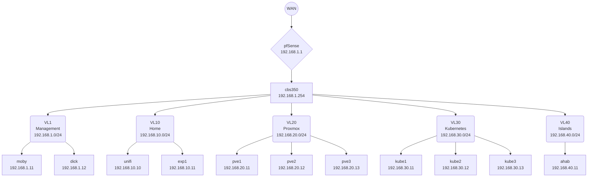

# network

```mermaid
flowchart TD
  A((WAN)) --> PFSENSE{pfSense<br>192.168.1.1}
  PFSENSE --> CBS350[cbs350<br>192.168.1.254]
  CBS350 --> VL1(VL1<br>Management<br>192.168.1.0/24)
  CBS350 --> VL10(VL10<br>Home<br>192.168.10.0/24)
  CBS350 --> VL20(VL20<br>Proxmox<br>192.168.20.0/24)
  CBS350 --> VL30(VL30<br>Kubernetes<br>192.168.30.0/24)
  CBS350 --> VL40(VL40<br>Islands<br>192.168.40.0/24)
  VL1 --> MOBY[moby<br>192.168.1.11]
  VL1 --> DICK[dick<br>192.168.1.12]
  VL10 --> UNIFI[unifi<br>192.168.10.10]
  VL10 --> EXP1[exp1<br>192.168.10.11]
  VL20 --> PVE1[pve1<br>192.168.20.11]
  VL20 --> PVE2[pve2<br>192.168.20.12]
  VL20 --> PVE3[pve3<br>192.168.20.13]
  VL30 --> KUBE1[kube1<br>192.168.30.11]
  VL30 --> KUBE2[kube2<br>192.168.30.12]
  VL30 --> KUBE3[kube3<br>192.168.30.13]
  VL40 --> AHAB[ahab<br>192.168.40.11]
```
